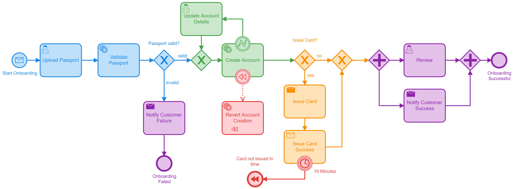

# Hand In 1

## Project Description

EventBank is a overly simplified banking system to study event driven architectures. The first use case that we are 
interested is to execute **card payments** that come in from an external payment provider. The service that are involved 
are the payment service that validates the card authorization and the accounts service that managed the balances of the 
customer accounts of the bank. The second feature of the EventBank is that accounts can be opened. Because the 
**opening of a bank account** can contain a lot of logic we use a process engine to manage the opening of the accounts.

## Portfolio Description

- E1: todo
- E2: We implemented event notifications between the cards service and the notifications service as well as an email notification between the account registration service and the notification service. -> TODO: Event-carried state transfer + Error Scenarios
- E3: We implemented a process to open an account (todo jonathan)
- E4: We thought in-depth about the tradeoff between commands and events. The result is the risk based approach and asynchronous execution of payments.
- E5: We implemented a saga pattern for the payment execution with stateful retry.
- E6: We created the hand-in documentation and polished the project.

The messaging parts were mainly implemented by Gian-Luca. The orchestration parts (process engine) were implemented by Jonathan. However, we did the concept of the processes together and also reviewed each others code.

The following description give a general overview of the implementation. More details can be found in the documented ADRs which can be found at `/adrs/`.

## Implementation of the Card Payments (E4/E5)

The card payments have some important requirements that we need to meet.

- Cards payments need to be processed fast. In practice, we would have a hard time limit in which we either have to process the card payment or we have to reject it
- Card payments need to be atomic. If we remove the money from a customer bank account we need to make sure the card payment is accepted. Otherwise the customer might be confused and pays again which leads to a double payment. If we accept the card payment we need to make sure the money is removed from the customer bank account.

Those requirements are very simplified compared to a real banking system. And one might argue that this is not a typical use case for event-driven systems. However, it would be kind of boring to study event driven architectures if we only have to deal with a very simple use case that has no requirements where event driven architectures struggle.

The following figure depicts the architecture of the services that handles the card payments and the different interactions.

Description:

1. The payment service receives the card payment from the external payment provider. It checks the authorization and business rules.
2. The cards service sends a synchronous message to the accounts service to reserve the balance of the payment. If the balance is not available the accounts service will reject the reservation. This step is optional and only executed if the cards service categorizes the payment as risky. In our mock scenario a payment is risky is the amount is higher than 1000. In a real world scenario this would be determined by the a much more complicated process.
3. The payments service now starts a new card payment sage. After this point the payment service already response to the external payment provider with with a success result. The first step of the sage is to send a payment event. The accounts service subscribes to the payment event and will execute the payment. Other services could also listen to the payment event and perform other actions such as fraud detection. In fact the notification service also listens to this type of events and sends a mock notification to the customer.
4. After the payment was successfully executed the accounts service will send a payment success event. When the payment was successfully executed the cards service will close the saga. If no such event is received the payment will be retied again and after a certain number of reties a error will be logged.

## Implementation of the Account Opening (E3)

The requirements of an account opening vary drastically from those of the card payment.

- The workflow involves multiple different domains and as such multiple microservices. The account opening involves the account domain, the card domain, a notification domain and potentially also a customer management domain, a card distributor domain, etc. 
- Varying and diverse latency and communication of each task and microservice. We have tasks that require human approval or have to be outsourced to third party services such as a passport validation. Issuing a physical card might take several days while a virtual representation of it can be done in seconds (or less).   
- Not only the main onboarding workflow has these requirements but also error handling with retries, timeouts, alternative processes, reverts, etc. For example, if a process fails after it successfully opened an account for the user it needs to revert these operations to have a consistent state.

Based on these requirements we can already see that a workflow engine is ideal for this task. 
Hence, our decision is to use the Camunda workflow engine. It allows us to automate the complicated workflow of machine and user tasks with diverse communication and time constraints. 
For this we use an orchestration pattern, a decision that is elaborated in this ADR (...). 

### Orchestration with Camunda 

The Camunda Workflow Engine provides us with multiple benefits for our use-case:
 - Graphical implementation and visualization of the end-to-end process with the Camunda Modeler
 - Orchestration of communication across multiple microservices with loose coupling
 - Monitoring and troubleshooting of event tokens and their state on the Camunda Platform Cockpit
 - Tracking time with timeout and retry actions for the event tokens
 - Error handling that allows us to specify alternative paths, retrying of tasks, etc. 
 - Simple inclusion of manual user tasks that can be handled the Camunda Platform Tasklist
 - Automatic versioning of new process models after changes
 - ...

### Implementation

We created a new service (the customer-registration-service) as the orchestrator of the customer onboarding process.
Communication with external microservices is done with a mix between synchronous and asynchronous communication.
For this communication we use a combination of REST and Spring Cloud Stream Kafka messaging. 
We split the process into five different colored areas to explain the process and methods used:

   

#### Blue - Start customer registration and passport validation
The workflow is initiated by a REST call to the customer-registration-service. 
After that we have a manual user task were the user has to input his passport number. In this case the user could
be the bank employee that checks if it's a real identity document. The workflow continues to a service task.
Here, we have a delegate in the service that validates the passport number based on passport number patterns.
Alternatively, this could be to an outside service that checks a database for blocked or fraudulent numbers.
An exclusive gateway decides if the onboarding workflow continues or not based on the validity of the passport number. 

Additionally, in case we offer online registration would be the option to upload a scan of a customers' identity document
in the user task and validation of it afterwards with an alternative workflow to upload an additional scan
in case of a validation failure. The flexibility of the Camunda Workflow Engine allows us to alter and extend
the model easily. 

#### Green - Create an account with exception handling
We reach a gateway that leads us to the create account service task. The service delegate calls the create account 
REST endpoint in the accounts microservice and waits for the response synchronously.
We decided to use a synchronous call for the simplified error handling. 
The higher latency is not crucial in this case; customer onboarding in not a super high frequency task and
the next steps in the workflow require a successful account creation. 

In case the account creation fails, we implemented an alternative workflow. 
The error event is initiated by a BpmnError in the create account delegate. In the alternative workflow 
the user can review the account input variables to update potential failure points. After that the account creation 
will be tried again. We are aware that this is a very simplified error handling case. A more sophisticated approach
would be a differentiation of the account creation exceptions that we receive and incorporate additional 
time based retries. 

#### Yellow - Issue a card if required
First, we have a simple decision if the customer wants a card or not. After that we send an asynchronous message to the 
card service via Kafka in the standard at-most once delivery mode. We then wait for an answer from the card service
which is also a Kafka message in the standard mode. Using the standard at-most once delivery mode means
that the delivery of one of those messages could potentially fail. For this case we use timeout events explained in the 
red section. The messaging is done asynchronously since the card issuing might need to be done by a third party provider
such as Visa. This would imply a higher latency and async allows us to be non-blocking during this latency.
After this, an exclusive gateway is used again to merge the two workflows, since the parallel gateway 
would wait for a token from the with and without card workflows. 

Additionally, a parallel workflow or sub-process directly after the issue card received service could be added for the 
production and delivery of a physical bank card. This could potentially take several days and would as such be isolated
from the main onboarding but still part of it.

#### Red - Timeout event and revert actions 
In case we do not receive an issue card success message from the card service in a duration of 10 minutes, 
activate a revert workflow. In our case this will revert the account creation and terminate the workflow.
This is of course also very simplified and faulty. A better option would be to retry the card issuing first and additionally 
guarantee to revert cards that were issued but not confirmed. In this case, it might also be advantageous to 
use an exactly once delivery despite the performance and setup drawbacks. This would fit better with our error 
handling workflow of the timeout and revert. 

#### Purple - Notification events and parallel execution
The parallel gateway allows us to execute to workflows in parallel for the same tokens. It is split at the 
first parallel gateway and merged again at the second were the workflow only continues after both impending 
workflows were completed. In our case the email notification message to the customer doesn't block the 
main workflow. However, this more as a demonstration rather than functionality. 

The email notification event messages are described in more detail in the next section. 

## Implementation of the Notifications (E2)

We used the event notification pattern in the notification service. When a payment is finished the card service
emits an event. The same holds true in the onboarding workflow, where we emit email notifications as events.
The notification service listens to these incoming events and processes the desired notification. As a result, 
the card and customer registration service are not dependent on the notification service (dependency inversion).
Sending notifications to the customer is something that is not crucial for the execution of a payment or onboarding
of a customer. This is why we can do this as fire and forget. We emit the message event asynchronously with at-most once delivery to
the Kafka messaging queue and forget about it. The hope is that our notification service picks it up and reacts accordingly. 
Hence, we can decouple the sender from the receiver and reduce latency. We don't need state management or information
about the receivers' execution.

In our implementation with Kafka we have one notification topic that handles phone and email notifications. 
For scalability reasons it would make sense to split these up into two different topics. These could be further broken
down into partitions. In our case the phone notifications likely requires multiple partitions since the amount
of payments is significantly higher than new customers. 

We use Spring Cloud Stream for all messaging interactions and Kafka as the broker. Spring Cloud Stream allows us to
replace and combine different brokers without changing the implementation details of the microservices and also brings 
multiple other benefits. However, in my opinion Spring Kafka was a bit simpler and more intuitive to get started. 

As in lab03 we follow the [Cloud Events](https://cloudevents.io/) specification for all messages.

## Experiments with Kafka: Delivery Guarantees (E1)

Our experiment is about the delivery guarantee of messages when using Kafka as the message broker.
When communicating between microservices it is crucial to answer following questions: 
- Are we required to guarantee the processing of all messages?
- How can we guarantee the processing fo all messages?
- Do we need to handle or avoid duplicate messages?

These questions are also very significant in our project. During a payment scenario it might be beneficial to
guarantee that a message arrives and gets processed exactly one time at the receivers side. While a notification
does not need that guarantee as it is only informative for the customer. With Apache Kafka we have three different 
types of message guarantees supported; at most once, at least once, and exactly once. Which delivery method we 
use has an impact on the consumer and producer configurations as well as the performance of the message deliveries. 
Here, we explore this three methods and test the different performances using consumer and producer of our payment topic.

### At most once
With the at most once guarantee the message is sent only once. Hence, it is processed
once or not at all. In Kafka the consumer will read messages from the topic and immediately
commit them before the processing starts. Thus, the unprocessed messages will be lost in case the 
consumer fails. 

At most once is the default behaviour in Kafka. No additional setup is needed. 
It is indicated with the `isolation.level=read_uncommitted` configuration.

The at most once delivery guarantee is the most performant method. In our case it did however not vary
much with the at least once guarantee. Since, no payment failures were indicated this is not surprising. Even
with higher loads we could not produce any messaging errors. 

### At least once
With the at least once delivery guarantee a message will be received and processed at least one time. 
However, in case of failures you might process some messages additional times. In Kafka this is ensured 
with acks from the Kafka broker. These must be received by the producer before he can write different 
messages to the topic again. A duplication of the message can happen because the producer often writes 
messages in batches which will be retried in case of a missing Ack.

The at least once delivery guarantee has no predefined configuration label in Kafka. Hence, the setup is 
the most complicated. We can define is using these configurations in the producer binding configurations:

      enable.idempotence: true
      max.in.flight.requests.per.connection: 1
      retries: 999
      acks: all

And these consumer binding configurations:

      enable.auto.commit: false

At least once delivery guarantee is in theory less performant than the at most once delivery. However, in our case
the duration of the payments under load is only slightly slower using this method. 

### Exactly once

With the exactly once guarantee we can make sure that a message is processed once, and only once. Kafka uses a 
special feature called the Kafka Transactions to ensure this delivery guarantee. A producer writes multiple messages to the 
topics and makes an atomic commit using a commit marker in case of success or abort marker if something went wrong 
in any of the messages. The consumer in turn will only read messages once we have a commit marker. In case of an abort marker, 
no message from this commit will be processed. 

The exactly once delivery method can be defined in the producer and consumer binding configurations using:

      isolation.level: read_committed

Setting the isolation level to read_committed will change these additional settings automatically:

      retries=Integer.MAX_VALUE
      enable.idempotence=true
      max.in.flight.requests.per.connection=1

Exactly once delivery is the slowest but also most reliable method. In our case it was about 20% slower than the
other methods. 

### Comparison

The comparison is done using sending payment operations to the HTTP endpoint. We used jMeter for the execution 
of these requests. The execution time is measured to the point were the last payment notification is registered.

|               | Requests | Failures | Execution Time |
|---------------|----------|----------|----------------|
| At most once  |  25,000  |     0    |    3:08 min    |
| At least once |  25,000  |     0    |    3:13 min    |
| Exactly once  |  25,000  |     0    |    3:46 min    |