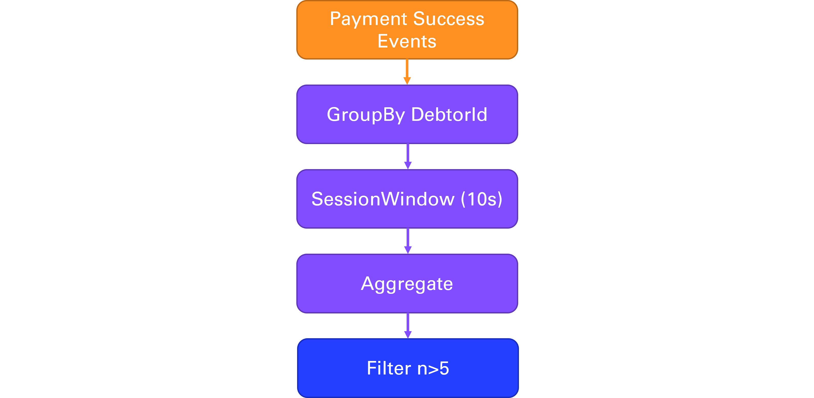
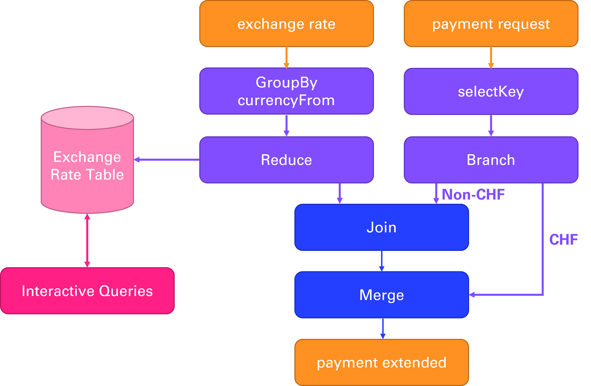

# Hand In 2

## Project Description

We extended our existing Event Bank project with two new features which are bases on Kafka stream processing. The first feature is **Payment Detection** which implements stateful stream processing to detect sudden pikes in transaction events. The second feature is **Foreign Currency Transaction** which adds information from a stream of exchange rates to the transactions. This features implements stateless stream processing, interactive lookups and stream joins.

As in the first part of the project each team member had his focus area. Jonathan mainly worked on the implementation of the **Foreign Currency Transaction** feature and Gian-Luca worked in the implementation of the **Payment Detection**. However, also like in part 1 we planned both features together and discussed the trade-offs and implementation hurdles in the complete project team.

## Payment Detection

The payment detection is implemented with stateful stream processing. It acts in a semi-passive ways, meaning if just consumes payment conformation events and if it detects a sudden spike in the number of transactions it will emit an warning. The code for this feature can be found in the risks service (`/risks`).

Although the streaming topology is quite small is brings a lot of complexity with it which we want to describe here. We decided to implement a relatively simple way to detect fraudulent payments: The risks service emits a warning if a certain number of transaction follow closely after each other. For demo purposes we choose a threshold of 5 transaction that occur with less than 10 seconds between them. In a real world bank payment fraud detection is even more complex and takes much more data points into consideration.

### Topology

To implement this feature we use the following stream processing topology:

1. **Input Stream** We consume the payment result events that are emitted by the accounts service. Since payment can be processed with a certain delay we use a custom TimeStampExtractor to extract the original payment time which is stored in the event message.
2. **Group by AccountId**: From the payment event we extract the account id of the debtor and group the events by this id.
3. **Session Window of 10s** We use a Kafka Stream session window to group the event in a temporal manner. The session window works well for our use case because it open a new window with every event unless another window was opened less than 10s ago. This gives us the nice property that we group the events that are close to each. Compared to a rolling window the size of the session window is flexible and grows if more events are coming in.
4. **Aggregate to List**: We want to collect all close transaction for detailed analysis. For this we implemented a customer aggregate function that adds all events to a list and returns the list.
5. **Filter n>5**: Next we filter out the aggregates that are interesting for us. We only want to keep the aggregates that have more than 5 events in them. But of course we could also implement much more complex filters here. 
6. **For Each**: As a final step we emit a warning for each aggregate that has more than 5 events. The other banking services are responsible for handling this warning. They could for instance block the card or send an email to the customer.

### Tradeoffs

The describes topology comes with one major tradeoff. Because we first aggregate the events to a list and in a next step do the filtering we run into an interesting problem. Kafka streams only closes the session window if is sees no more events for that account in for the session grace period which is 10s in our case. Kafka also only forward the aggregate to the next step if the window is closed. This results in the effect that for example after 5 payments occured and we could issue the warning our system waits 10s because maybe it there will be another payment. However, due to our use case this is not needed because we should directly emit the warning. Furthermore is opens up a possibility for an interesting attack: If an attacker uses the card every 10s forever the system will emit the warning because the session window is never closed.

We see two similar ways to solve this problem. First we see that the aggregate function is called as soon as the payment is added to the session window. Compared the the filter function Kafka Streams does not wait here until the window is closed. The reason for this is most likely performance optimization by Kafka Streams because aggregates can be expensive and therefore it makes sense to start with the computation as soon as as possible. We could exploit this by using the code from the aggregate function for the filtering and to emit the warning. Warnings would then be emitted much faster and we also don't need to wait until the window is closed. The same behavior could also be achieved with a customer processor using the Kafka Streams Processor API.

Both approaches come with some similar drawbacks: The current streaming topology is very self explaining and if one takes a look on the documentation they can clearly see what is going on which the different aggregate and filter steps. If we implemented the filtering within the aggregate function the topology would end up after the aggregate. Aggregations are usually without side-effects so this would be a very odd way to implement this. In the documentation we would need to show very explicitly that this aggregation has side-effects by design. Furthermore it is not documented by Kafka Streams that the aggregate function is called as soon as a new element is added to the window (At least we did not find it). To rely on this undocumented behavior would be a very bad practice and our code could start failing is Kafka Streams changes its internal implementation. Were the first reason could be discussed the second with the undocumented behavior is much more grave.

Due to this we decided to stay with our current *naive* implementation. Maybe the best way to implement this would be so implement a new window type that is similar to the session window but provides the processing guarantees that we need for the following steps. However, we quickly looked into it and decided that it would be a lot of work and we would not be able to implement the filter step in a reasonable time. Especially if we take into consideration that our implementation must work with different streaming an computing partitions. However, analyzing this problem was very interesting and both of us learned a lot about Kafka Streams internals and limitations.

## Foreign Currency Transaction

The Foreign Currency Transaction feature adds information from a stream of exchange rates to the transactions. It implements stateless stream processing, interactive queries and stream joins. The foreign currency transaction processor sits in between the cards and account services. Instead of the account service directly processing the payment requests of the cards service the currency processor will extend these requests with the latest exchange rate of the payment currency to CHF and update the amount based on it. The extended payment will be published on a new topic which is in turn consumed by the account service. 

Additionally, if the payment exceeds a certain amount the card service will reserve the amount of the payment on the account service. This reservation was previously also handled without currency information but does now require to update the amount based on the exchange rate as well. The reservation is done with an HTTP POST request and not Kafka. Hence, we created a table with the most recent exchange rates in the currency service. This table can be queried with REST calls to receive the latest rate for a specific currency to CHF or for the whole table. So, to reserve the payment on the account we first query the latest rate to update this amount.

### Topology

- **Payment Request**
    1. **Input Stream:** The payment request is consumed as a KStream from the payment-request-topic that is produced by the card service. In this new feature the payment request now has a currency field. 
    2. **Select Key:** The mentioned currency field is used as the key of the stream which we select after the build.
    3. **Branch by currency:** The payment stream is branched by the currency into two branches: one branch is for payments in CHF, the other branch is for payments in other (foreign) currencies. I used filter and filterNot instead of branches since branches is deprecated.
- **Exchange Rate**
    1. **Input Stream:** The exchange rate topic is also consumed as a KStream from the exchange-rate-topic which is emitted by the exchange rate service. The topic contains various foreign currencies (currencyFrom) and an exchange currency which is always CHF here (currencyTo). Additionally, the exchange rate to calculate from currencyFrom to currencyTo (rate).
    2. **Group By CurrencyFrom:** From the exchange rate stream we extract the currencyFrom to group by.
    3. **Reduce:** We reduce the grouping by the newest value for each of the keys. The result is stored as a KTable-
    4. **Exchange Rate Table:** The resulting table with the newest value for each currency pair is stored as a key value store that can be queried. 
        - **GET exchange rates:** The table can be queried for a list of all exchange rates by sending a GET request to the `/rates` endpoint.
        - **GET specific exchange rate:** The table can be queried for a specific exchange rate by sending a GET request to the `/rates/{currencyFrom}` endpoint.
- **Extended Payment**
    1. **Join (Foreign Currencies):** We join the payment request KStream branch of foreign currencies with the exchange rate KTable. The join uses a custom ValueJoiner and is based on the currency key from the payment stream and the currencyFrom key from the exchange rate table.  
       - **Extended Payment:** We use a custom ValueJoiner that creates a new extended payment data object based on the payments and newest exchange rates. The amount of the payment is updated based on the exchange rate and the previous amount stored as originalAmount. The currency is updated to CHF and the original previous currency stored as originalCurrency. The exchange rate used is stored as well.
    2. **For Each (CHF):** On the CHF payment request KStream we use mapValues to create the extended payment data object based on an exchange rate of 1:1 as it remains CHF.
    3. **Merge Foreign with CHF:** The extended payments streams of the foreign currencies is merged with the one for CHF to a combined extended payment stream.
    4. **To extended payment topic:** The merged extended payment stream is produced to a new topic which is consumed by the accounts service. 

### Trade Offs 

#### Exchange Rate stream

The initial idea for the exchange rate topic was the use of a GlobalKTable. The reason for this is, that the topic is keyed by the currencyFrom, compacted, and has a bounded keyspace. Meaning, only the latest record for each unique key in the topic is relevant. The use of a GlobalKTable instead of a KTable is because of having a distributed table state. Meaning, the global table state is not partitioned but replicated, hence, we have full data access on all stream partitions. While, this would not be an issue in the current state of EventBank (we use only one partition) it would be a benefit in terms of state management and simplicity if we scale the application. A further reason to use a global table is also the rather small number of currency pairs (unique keys) and argument against it and for common KTables would be the relative high frequency that the exchange rates are updated as well as the time synchronized processing. Time synchronization would certainly be beneficial to immediately use the latest exchange rate. In our case we believe that the benefits of a global table slightly outweigh the benefits of a KTable, but both seem to be a valid option. 

While we believe the GlobalKTable to be the best option in theory. In practice, we had some problems setting it up correctly. Especially, we had some issues with the parameterized Message Serdes. The parameterized class, in this case the ExchangeRateEvent, was converted to a linked hash map by kafka. However, in the code it was defined as the data class. The same issue also appeared when using the toTable method provided by kafka (code snippets of this can be found in the CurrencyTopology). I thought it as possible that there is an issue with the Serdes deserializer, but hours of testing have not solved it. For this reason we ended up using a KTable that we created with a groupBy and reduce on the KStream. An advantage of the current implementation compared to using a GlobalKTable and/or using the toTable method by kafka is that the stream will not be repartitioned. Thus, we do not have out-of-order data. 

The KTable store is materialized to allow interactive queries. It is a non-windowed key-value read-only store. Because we run only one instance our local table state represents the whole table. In case we scale this topic we would have to add additionally functionality that collects the different fragments of the table to allow remote queries via RPC or REST. 

#### Stateful vs Stateless

The flow of the payment requests to the payment extended is stateless. Here, we do not require to understand any relationships between event as we extend each payment with additional information, regardless of its key, time, or any other information. However, the foreign currency branch is joined with a stateful table, hence here we have a stateful operation. We use a stateful exchange rate table to receive the latest records for each currency pair. This allows as to create a materialized real-time table that can be queried. In case we use a stateless stream for the exchange rate to join with the payments, we would have to wait for each payment to receive a new exchange rate update for the currency pair before it is joined. With the stateful table it only requires a lookup.

#### Scalability

Instead of creating additional partitions of payments and exchange rates we could prevent difficult partitioning tasks with creating an individual topic for each currency pair. The drawback would be an increased codebase and extensibility. The benefits' scalability, performance and understandability. This could also be achieved with re-keying to meet the co-partitioning requirements. However, this is an expensive operation.

#### Most recent exchange rate

One potential issue is the time we extend the exchange rate to the payment. Currently, this is not dependent on the time when the payment was executed but on the time the payment is processed by the currency processor. With the stateful retry pattern we use for the payments, this could mean that the exchange rate of the first try is different to the fourth try. Additionally, when we first reserve an amount the rate might also be slightly different, since that is done beforehand and uses REST calls which is not as performant. For the current version we think that the drawbacks are not major and the added simplicity outweighs it. However, a potential useful addition to prevent this is a windowed table for the exchange rate and a payment timestamp, we then use the exchange rate based on the window from the timestamp.

### Avro Schemas

We decided not to use Avro Schemas. The main reason for this is the use of the CloudEvent specification as a message envelope. Every topic in our application uses this specification with a custom serializer and deserializer. Building the avro schemas on top of it seemed complicated and overengineered. Replacing only the effected topics would create inconsistent messaging. Hence, we decided not to use Avro Schemas in the current state. We do recognize however that it would be useful in an enterprise application, especially with a schema registry that stores the Avro schemas. Advantages would be a defined and typed schema that can be evolved over time in a safe manner and discovered in the registry. Additionally, its efficient and requires less storage than for example json. To build Avro Schemas on top of CloudEvents we found this format specification: [link](https://github.com/ashwinspg/cloudevents-spec/blob/main/cloudevents/formats/avro-format.md)

